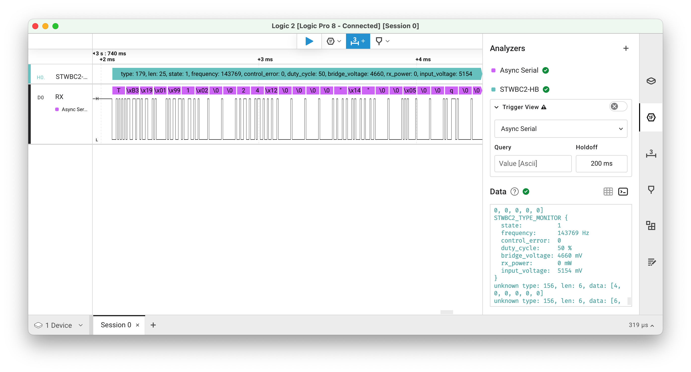

# STWBC2-HB Logic Analyzer Extension

This Logic 2 High-Level Analyzer extension decodes the monitoring data from the STWBC2-HB wireless charging and power delivery chip from STMicroelectronics.



## Functionality

The analyzer decodes messages that follow this format:
- Start marker: 0x54
- Message type byte
- Message length byte
- Message data

### Monitor Message (Type 0xB3)

For monitor messages (type 0xB3), the analyzer decodes and displays the following parameters:
- State: Current operating state of the chip
- Frequency: Operating frequency in Hz (4-byte value)
- Control Error: Control error value
- Duty Cycle: Current duty cycle percentage
- Bridge Voltage: Bridge voltage in mV (2-byte value)
- RX Power: Received power in mW (2-byte value)
- Input Voltage: Input voltage in mV (2-byte value)

### Other Messages

For other message types, the analyzer displays:
- Message type
- Message length
- Raw data bytes

## Usage

1. Install this extension in Logic 2
2. Add it as an analyzer to your capture
3. Configure it to analyze your STWBC2-HB communication channel
4. The decoded messages will be displayed in the Logic 2 interface

## Message Format Details

### Monitor Message Structure (0xB3)
```
Byte 0:  0x54 (Start marker)
Byte 1:  0xB3 (Message type)
Byte 2:  Length
Byte 3:  State
Bytes 4-7: Frequency (LSB first)
Byte 8:  Control Error
Byte 9:  Duty Cycle
Bytes 10-11: Bridge Voltage (LSB first)
Bytes 12-13: RX Power (LSB first)
Bytes 16-17: Input Voltage (LSB first)
```